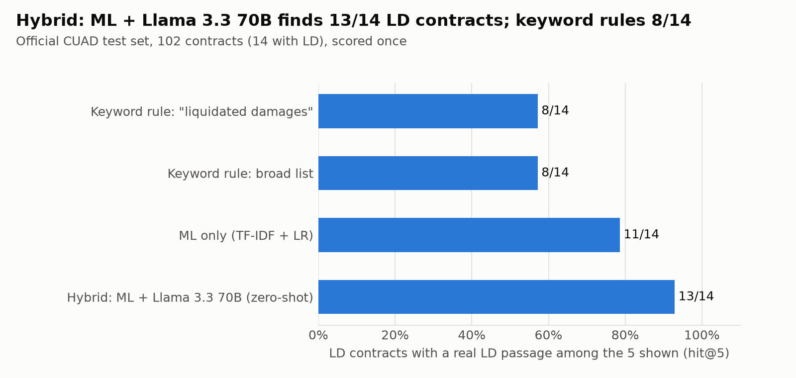
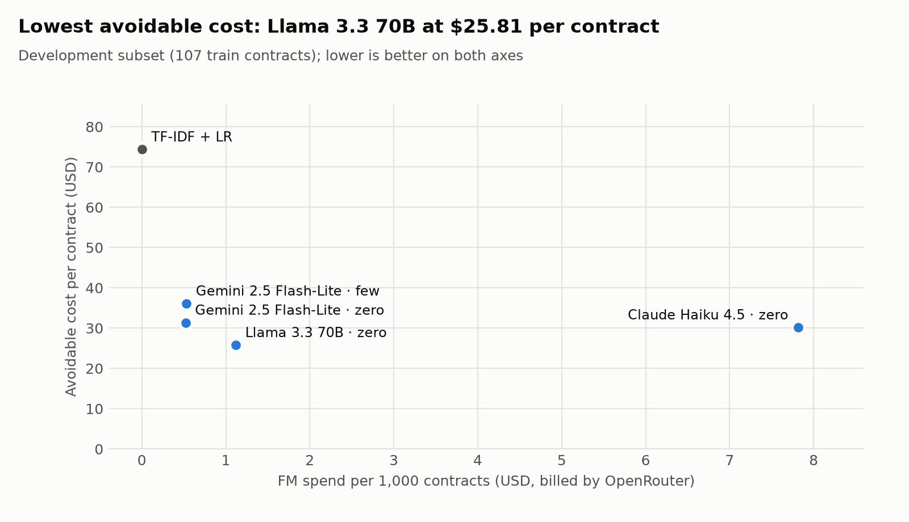
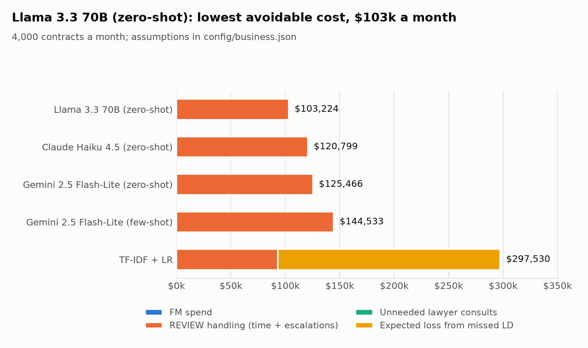

# ContractGuard — flags liquidated-damages clauses before SMEs sign

ContractGuard screens an English commercial vendor contract for **one** clause type: liquidated damages and
termination fees (CUAD definition). It shows the owner of a small business the 5 passages worth reading and a label:
**FLAG**, **REVIEW** (the system abstains and hands over to a person) or **NO_FLAG** ("nothing found", never "safe").
It flags only. It does not rewrite clauses, judge enforceability, or give legal advice.

Data: [CUAD v1](https://github.com/TheAtticusProject/cuad) (The Atticus Project, CC BY 4.0), official split:
408 train contracts (development) and 102 test contracts (scored once).

## How it works

```
contract ─▶ extract.py (refuse if too little text) ─▶ chunker.py (100 words, stride 50)
        ─▶ TF-IDF + logistic regression scores every chunk          (own model, CPU, ~$0)
        ─▶ candidates = ML top 20 + keyword hits (≤ 30)
        ─▶ ML score ≥ 0.88 ?  yes ─▶ FLAG (the FM is not asked, so injected text cannot clear it)
                              no  ─▶ ONE batched FM call via OpenRouter (model of your choice, forced JSON tool output)
        ─▶ router.py decision rules ─▶ FLAG / REVIEW / NO_FLAG + 5 passages
```

An **FM call** is one request to a rented foundation model through [OpenRouter](https://openrouter.ai), which serves
many providers' models behind one API: the ~20 candidate passages go out, one JSON record per passage comes back
(`chunk_id, label, confidence, evidence`), and OpenRouter reports the billed cost of that call. An LD label only counts
if its `evidence` is an exact quote from that passage.

## Quick start

```bash
python3 -m venv .venv && source .venv/bin/activate
pip install -r requirements.txt
cp .env.example .env          # then paste your OpenRouter key after OPENROUTER_API_KEY=
streamlit run app.py          # pick a model in the sidebar, try the files in demo/
python src/prices.py --refresh  # current prices of every candidate model -> results/price_table.md
pytest -q                     # 25 tests: chunker, decision rules, FM guardrails, OpenRouter parsing, prices, extraction, split
```

**API key.** Keys live only in `.env`, which is in `.gitignore`, so they never reach GitHub (`.env.example` is the
committed template). The app also accepts a key typed into the sidebar for the current browser session only.
Without a key the app runs the ML model alone. Uploaded contracts are processed in memory and never written to disk.

**Choosing the model.** `config/models.json` lists 11 candidate OpenRouter models in four tiers (premium, mid, budget,
open weights), each with the maker's official list price, its source URL, and OpenRouter's price (checked 2026-09-29).
The app's sidebar offers the same list plus any other id, shows the price and an estimated cost per contract, and has
a price table for all candidates.

**Keeping prices current.** `python src/prices.py --refresh` pulls live prices from OpenRouter's public model list
(no key needed), caches them for 24 h and writes `results/price_table.md` (models sorted by estimated cost per
contract and per month). Add `--update-snapshot` to write the live prices back into `config/models.json`. The app and
`compare_models.py` use live prices automatically when online and fall back to the snapshot when not. The cost used in
the evaluation is always the amount OpenRouter actually billed for each call.

## Reproduce the evaluation

Put `CUADv1.json` in `data/raw/` (download from the CUAD repository). `data/raw/test_titles.json` lists the 102
official test contracts (taken from CUAD's `test.json`).

```bash
python src/prepare_data.py                          # chunk + label every contract: pos / hard_neg / boiler_neg
python src/experiment_cv.py                         # DEV  5-fold CV on 408 train contracts, 5 designs compared
python src/oof_analysis.py                          # DEV  thresholds -> results/frozen_settings.json
python src/official_eval.py                         # TEST once: keyword vs ML baselines, bootstrap CI, saves the model
python src/stress_eval.py                           # stress set, ML-only (no key needed)
# FM steps (need OPENROUTER_API_KEY in .env the first time; later runs are served from results/fm_cache.jsonl):
python src/compare_models.py --only google/gemini-2.5-flash-lite                  # model comparison on the dev subset
python src/compare_models.py --only google/gemini-2.5-flash-lite --prompt few     # prompt technique: few-shot
python src/compare_models.py --only google/gemini-2.5-flash-lite --samples 3      # prompt technique: self-consistency
python src/compare_models.py --only meta-llama/llama-3.3-70b-instruct anthropic/claude-haiku-4.5
python src/evaluate_hybrid.py --split dev --prompt zero --model meta-llama/llama-3.3-70b-instruct --workers 8 --freeze
python src/evaluate_hybrid.py --split test --workers 8                            # TEST once with frozen settings
python src/stress_eval.py --fm                                                    # stress set with the hybrid
```

Every FM call is logged to `results/fm_calls.jsonl` (model, tokens, billed cost, latency) and cached in
`results/fm_cache.jsonl`, so anyone can re-run every number above without a key and without paying.

### Business trade-off: model comparison
`src/compare_models.py` runs the same pipeline with each enabled model on a fixed development subset (all 47 LD train
contracts + 60 others; `--full` for all 408) and writes `results/model_comparison.md` / `.csv`: hit@5, FLAG precision,
silent misses, abstention rate, FM precision/recall, failed calls, billed cost per contract, latency p50/p95, and a
monthly projection (`--contracts-per-month`, default 4,000 = 1,000 SMEs x 4 contracts) of FM spend and of REVIEW cases a
person must read. Model ids that OpenRouter does not list, or that lack tool calling, are skipped with a note.

### Numbers and figures for the report
```bash
python src/business_case.py     # cost to serve per month: FM spend + owner review time + unneeded lawyer consults + expected loss
python src/make_report.py       # results/report_tables.md + figures/fig1..3.png (ladder, model trade-off, monthly cost)
```
`config/business.json` holds every business assumption (contracts per month, minutes per review, hourly value, lawyer
consult cost, loss per missed clause, share of REVIEW cases that still end with a lawyer) with its source or an
ASSUMPTION tag. The REVIEW / FLAG thresholds are chosen on
the development split by minimising that cost, with at most 5% of LD contracts allowed to end as NO_FLAG.

### Train / test discipline
`src/common.py` owns the split. `load_dev()` returns only the 408 train contracts and fails if a test contract appears.
Only `official_eval.py` and `evaluate_hybrid.py --split test` call `load_test()`, and only with settings read from
`results/frozen_settings.json`. `evaluate_hybrid.py` refuses a second test run unless forced. Keyword lists live in
`common.py` and were fixed before any test run.

## Repository map

| path | role |
|---|---|
| `app.py` | Streamlit interface: upload / paste / demo, label, 5 highlighted passages, cost, disclaimer |
| `src/chunker.py` | one chunker for training, evaluation and the app |
| `src/prepare_data.py` | labels every chunk `pos` / `hard_neg` (other CUAD category) / `boiler_neg` (unannotated) |
| `src/common.py` | loaders, official split + leakage guard, keyword rules, model factory, metrics |
| `src/experiment_cv.py` · `src/oof_analysis.py` | development experiments and threshold freezing (train only) |
| `src/official_eval.py` | one-shot test evaluation of the ML baselines; trains `models/tfidf_lr.joblib` |
| `src/fm_verify.py` | the FM call (OpenRouter or Anthropic): prompt, forced JSON schema, re-validation, evidence check, cache, billed-cost log |
| `src/config.py` · `config/models.json` · `.env.example` | reads the git-ignored `.env`; candidate models with official + OpenRouter prices |
| `src/prices.py` | live OpenRouter prices (24 h cache) → snapshot → official; price table and cost per contract / month |
| `src/compare_models.py` | quality vs cost vs latency for every candidate model (dev only) |
| `src/router.py` | deterministic decision rules and passage ranking |
| `src/pipeline.py` | end-to-end analysis used by BOTH the app and the evaluation |
| `src/extract.py` | PDF / DOCX / TXT extraction with a refusal rule |
| `src/evaluate_hybrid.py` | prompt ladder and T_REVIEW tuning on dev; one-shot hybrid test run |
| `src/stress_eval.py` · `eval/` | 50-case stress set (paraphrases, hard negatives, prompt injections), labels fixed first |
| `prompts/` | system prompt and few-shot examples (the same text can be pasted into the Anthropic Console) |
| `demo/` | two CUAD test contracts and a fictional catering supply contract (with and without an injection) |
| `tests/` | pytest suite |

## Results

All tables and figures: `results/report_tables.md` and `figures/` (rebuilt by `python src/make_report.py`).

**Official test set** (102 contracts, 14 with LD, 23 spans), scored once with settings frozen on the 408 development
contracts. hit@5 = share of LD contracts where at least one of the 5 passages shown is a real LD clause (recall at a fixed
review budget, so "flag everything" cannot win); a *silent miss* is an LD contract labelled NO_FLAG.

| system | hit@5 [95% CI] | silent misses | FLAG precision | sent to a person | FM cost / contract |
|---|---|---|---|---|---|
| keyword "liquidated damages" | 8/14 [0.29, 0.79] | 7/14 | 100% | 0% | $0 |
| keyword broad list | 8/14 [0.36, 0.86] | 3/14 | 28% | 0% | $0 |
| ML only (TF-IDF + LR, all chunks as negatives) | 11/14 [0.57, 1.00] | 2/14 | 100% | 27% | $0 |
| **hybrid: ML + Llama 3.3 70B, zero-shot (frozen)** | **13/14 [0.79, 1.00]** | **0/14** | **100%** | 40% | $0.0011 |



**Negative examples** (dev 5-fold CV): training only on other annotated clauses gives 7.1 false-positive chunks per
non-LD contract; adding unannotated boilerplate chunks as negatives cuts that to 0.07 and raises hit@5 from 0.83 to 0.88.

**Choice of FM** (dev subset of 107 train contracts, all 47 with LD + 60 without): Gemini 2.5 Flash-Lite, Llama 3.3 70B
and Claude Haiku 4.5 all reach 0 silent misses; what separates them is how many contracts still need a person.
Llama 3.3 70B has the lowest avoidable cost per contract ($25.81 vs $31.37 Flash-Lite and $30.20 Haiku) at
$0.0011 of FM spend, but takes about 20 s per contract; Haiku costs 7x more per call without fewer reviews.
GPT-5.6 Luna could not be used: no OpenRouter provider served it with forced tool calling. Zero-shot beat few-shot.



**Cost to serve** (4,000 contracts a month, assumptions in `config/business.json`): ML only ≈ $297k of avoidable cost a
month, mostly expected losses from about 41 missed LD contracts; the hybrid ≈ $103k, all of it REVIEW handling, while
FM spend is under $5 a month. The ranking holds when the loss per missed clause is $1k or $20k and when 0% or 50% of
REVIEW cases end with a lawyer.



**Stress set** (50 clauses written before any run): the hybrid misses none of 20 paraphrased LD clauses or 10 LD clauses
carrying injected instructions (ML only: 11/20 and 3/10 silent misses) and flags none of 20 hard negatives.

## Limitations
CUAD contains contracts filed by US public companies, not SME agreements (the vendor-type subset is small: 30 test
contracts, 4 with LD). The test set holds only 14 LD contracts, so one contract moves hit@5 by 7 points. Models were compared
on a dev subset with only 60 non-LD contracts, so REVIEW-rate differences of a few points between them are within noise.
Business figures rest on stated assumptions, not measured SME costs. The stress set was drafted with AI assistance. NO_FLAG is not a clearance.

## Licence and attribution
Code: written by Chen Yayue for NTU PE6201 (no open-source licence chosen yet). Data: CUAD v1 by The Atticus Project, CC BY 4.0 — processed files and excerpts in `demo/` are derived from it.
