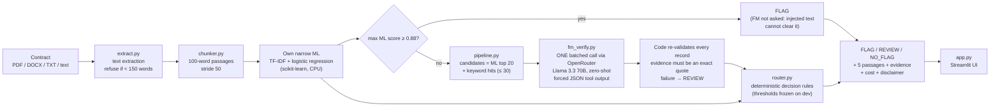

# ContractGuard: product documentation

**What it is.** It flags liquidated-damages and termination-fee clauses in a vendor contract before a small business signs.
It flags only. It does not rewrite clauses, judge whether they are enforceable, or give legal advice.

## 1. Persona

**Mei** runs a six-person catering business in Singapore. On Wednesday evening she has a 30-page supply contract from
a new produce vendor that must be signed before Friday's first delivery. She has never paid a lawyer to read a vendor
contract. She does not know that a clause such as "a fee equal to three months of orders is payable if the
Customer ends the agreement early" is the kind that can cost her thousands. She reads English well but is not a
lawyer and has never seen a confidence score.

**What changes for Mei.** Today she skims the contract or signs it unread (62% of small-business owners say they sign
contracts they do not fully understand). With ContractGuard, she uploads the file and the result tells her what to do:

* **FLAG**: there is an LD or termination-fee clause, with the 5 passages to show a lawyer. Worth one paid consult.
* **REVIEW**: the system is not sure. She reads the 5 highlighted passages herself, about 10 minutes, and decides
  whether to ask a lawyer.
* **NO_FLAG**: nothing was found. The app says plainly that this is not a clearance.

## 2. Input and output

| | |
|---|---|
| **Input** | One English commercial contract: PDF with a text layer, DOCX or TXT upload, or pasted text. Files are read in memory and never written to disk. Fewer than 150 readable words (e.g. a scanned PDF) → the app refuses rather than guess. |
| **Output** | A label (FLAG / REVIEW / NO_FLAG) with a one-line reason; the 5 passages most worth reading, each with its ML score and, where the FM said LD, the exact quoted evidence highlighted; the FM cost and latency of this contract; a no-legal-advice disclaimer. |
| **Out of scope** | Other clause types, non-English contracts, scanned documents without OCR, drafting or negotiating clauses, any statement about legal consequences. |

## 3. Architecture

| layer | own / rent | what | why |
|---|---|---|---|
| interface | rent (open source) | Streamlit | a one-page upload-and-read UI is commodity |
| orchestration and decision rules | **own** | `pipeline.py`, `router.py` | abstention and safety rules are the product and must be auditable |
| retrieval model | **own** | TF-IDF + logistic regression on CUAD chunks | labels exist; milliseconds on a CPU, ~$0 per contract |
| verification model | rent | Llama 3.3 70B (open weights) via OpenRouter | cheapest avoidable cost in the comparison; open weights allow self-hosting later |
| tools | rent (open source) | pypdf, python-docx | text extraction |
| data | rent + own | CUAD v1 (CC BY 4.0) + my chunk-level labelling | dataset is public; the negative design is mine |
| evaluation and observability | **own** | `evaluate_hybrid.py`, `compare_models.py`, `fm_calls.jsonl` | metrics specific to this problem; every call logged with tokens, billed cost and latency |

**Where the FM is, and where it is not.** The FM gives a second opinion on about 20 passages per contract and must quote
its evidence. It never decides alone. Deterministic code makes the final label. The FM cannot clear a high-confidence
ML FLAG. An FM "LD" verdict on a passage the ML model scores low becomes REVIEW, not FLAG. Any FM failure becomes
REVIEW, never NO_FLAG.

## 3b. Which kind of AI, and why (course classes 1–6)

| class | decision | evidence |
|---|---|---|
| 1 · which AI for which job | narrow ML for retrieval, because labels exist and the task is one bounded category; an FM only as a verifier with quoted evidence; deterministic rules decide | ladder on test: keyword 8/14 → ML 11/14 → hybrid 13/14 hit@5 |
| 2 · build vs buy | own the routing, the retrieval model and the evals; rent the interface library, the FM and the data | layer table above |
| 3 · prompting techniques | zero-shot chosen. Few-shot and self-consistency (3 answers, vote) were measured and rejected: both sent more contracts to REVIEW, and self-consistency cost 2.6x. Structured output (forced JSON tool) is used everywhere. Chain-of-thought was not used: it multiplies output tokens, and the evidence quote already makes each verdict checkable | `results/report_tables.md` §3 |
| 4 · agents | **not used, on purpose.** Each contract needs one fixed path (extract → score → verify once → decide), with no tool choice or multi-step loop. An agent would add calls, latency and failure modes without a step that needs planning | — |
| 5 · cost to serve | FM cost per contract = 0.83 calls × (3,645 input tokens × $0.10/M + 603 output tokens × $0.32/M) ≈ $0.0005 at list price; OpenRouter billed $0.0011 because it routed some calls to dearer Llama providers. Monthly cost to serve and sensitivity in §4 of the report tables | `results/report_tables.md` §4a–4b |
| 6 · responsible AI | abstention, evidence check, injection defences, no-advice scope | §5 below |

**The metric decision.** Recall alone is won by flagging everything, and "zero silent misses" alone is won by sending
everything to REVIEW. So the headline is **hit@5**, recall at a fixed budget of 5 passages per contract. It is always
shown with FLAG precision, the REVIEW rate and the business cost that weighs them, and thresholds are chosen by that cost.

## 4. Metrics: targeted vs reached

Targets come from my Milestone-1 problem statement (P), the instructor's feedback on it (F), or were fixed during the
build on development data before any test run (B).

| metric | target | source | reached (official test: 102 contracts, 14 with LD; scored once) |
|---|---|---|---|
| hit@5: LD contracts with a real LD passage among the 5 shown | miss fewer than the TF-IDF baseline (11/14) and the keyword rule (8/14) | P, F | **13/14** [95% CI 0.79–1.00] ✅ (the CI overlaps ML-only's [0.57–1.00]) |
| silent misses (LD contract labelled NO_FLAG) | ≤ 5% of LD contracts | P, B | **0/14** test, 0/47 dev, 0/30 stress LD clauses ✅ |
| FLAG precision (paired with recall, per feedback) | report beside recall; no numeric floor set in advance | F | **100%** test (7/7), 84% dev ✅ |
| abstention: how often, and on the right cases | report both | P | REVIEW **40%**; correct on 61/61 decided contracts; **34/34** would-be errors landed in REVIEW ✅, but 40% is a heavy load |
| FM cost per contract | "quick, low-cost" | P | **$0.0011** ✅ |
| avoidable cost per contract (business) | lower than ML only | B | dev subset: $25.81 vs $74.38 ML only (assumption-based) ✅ |
| latency | none set | | median **26 s** per contract (one FM call) ⚠️ |
| robustness to prompt injection | no injected clause cleared | B | 0/10 silent misses ✅ |

Rough edges that I report rather than hide: the REVIEW rate is high; the test set has only 14 LD contracts, so one
contract moves hit@5 by 7 points; the business figures rest on stated assumptions.

## 5. Risks and mitigations

| risk | mitigation built (and where) | reference |
|---|---|---|
| **Silent failure**: an LD clause is missed and the contract shows NO_FLAG | retrieve-then-verify, so the FM sees the ML's 20 best candidates plus every keyword hit; FM "LD" with low ML score → REVIEW; thresholds tuned with silent misses ≤ 5%. **Detection**: silent-miss rate measured on test and stress sets; in production, audit a sample of NO_FLAG contracts and watch the reason codes in the log | IMDA Model AI Governance Framework (human-in-the-loop) |
| prompt injection inside a contract | passages sanitised (`<` `>` replaced) and fenced; ML-high FLAG bypasses the FM; forced JSON schema re-validated in code; stress set has 10 injected cases (0 cleared) | OWASP Top 10 for LLM Applications 2025: LLM01 Prompt Injection |
| FM invents evidence | an LD verdict only counts if its evidence is an exact substring of the passage (26% of the FM's LD answers on test failed this check and were discarded) | OWASP LLM05 Improper Output Handling, LLM09 Misinformation |
| over-reliance: user reads NO_FLAG as "safe" | three labels with abstention; the NO_FLAG text says it is not a clearance; disclaimer on every result | IMDA framework (transparency to users) |
| confidential contract sent to a third party | only the 20–30 candidate passages leave the machine, not the whole file; uploads are never stored; the chosen model has open weights, so it can be self-hosted | OWASP LLM02 Sensitive Information Disclosure; Singapore PDPA if a contract contains personal data |
| FM outage, empty or partial answer | repair calls for missing ids; anything still missing → REVIEW; test summary refused if any call failed | |
| runaway cost | one FM call per contract, at most 30 passages, `max_tokens` capped; every call's billed cost logged | OWASP LLM10 Unbounded Consumption |
| unreadable input | fewer than 150 words extracted → refuse and ask for a text PDF | |

**Intended use**: a first screen by a small-business owner or office manager before signing an English commercial
vendor contract. **Not for**: legal advice, deciding whether a clause is enforceable, drafting, employment or consumer
contracts, or any automatic legal action. Under the EU AI Act this is a limited-risk transparency use (users are told
they are interacting with an AI screen), not a high-risk system. That classification is my reading, not legal advice.

## 6. How the design changed after Milestone 1

| Milestone 1 plan | final | why |
|---|---|---|
| negatives sampled from other annotated clauses (1:3) | every non-LD chunk, incl. unannotated boilerplate | instructor feedback; false positives per non-LD contract fell from 7.1 to 0.07 |
| recall / FNR as the main metric | hit@5 (recall at a fixed budget of 5 passages) + silent misses + FLAG precision | instructor feedback: recall alone is won by flagging everything |
| 41 validation contracts | 5-fold CV over all 408 train contracts, grouped by contract | 47 LD contracts are too few to hold out 4 of them |
| abstention below a 0.6 score | REVIEW / FLAG thresholds tuned on dev by business cost | ties the threshold to what a mistake costs Mei |
| FM chosen by benchmarking | 4 rented FMs compared on quality, cost and latency (plus FM alone with no ML); Llama 3.3 70B chosen | lowest avoidable cost; GPT-5.6 Luna unusable (no forced tool calling) |
| compare FM zero-shot classification | measured as the lowest rung: FM alone on every passage, hit@5 36/47, FLAG precision 51%, 11 calls per contract | the ML retrieval step is what makes the FM affordable and precise |
| straight to code, no low-code | unchanged | the work is custom chunking, routing and evaluation that a no-code builder cannot express; the system prompt in `prompts/` can be pasted into any model playground |
